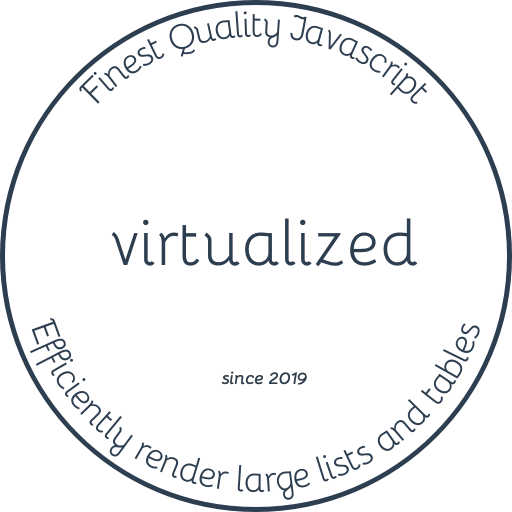

<div class="text-xs-center" align="center" style="margin: 20px">
  
</div>

<div class="text-xs-center" align="center">

[](https://npmjs.com/package/@znck/virtualized)
[](https://npmjs.com/package/virtualized)

</div>

## Introduction

Efficiently render large lists and tables

> **WARNING:** ⚠️ This is an experimental project. Wait for 1.0 release for using in production.

## Install

```bash
npm add @znck/virtualized
```

## Usage

```js
import S from '@znck/virtualized'

...
```

## Credits

This project is highly inspired from Brian Vaughn's [react-virtualized](https://github.com/bvaughn/react-virtualized) and Guillaume Chau's [vue-virtual-scroller](https://github.com/akryum/vue-virtual-scroller).

## Contributing

Please read [CONTRIBUTING.md](CONTRIBUTING.md) for details on our code of conduct, and the process for submitting pull requests to us.

## Versioning

We use [SemVer](http://semver.org/) for versioning. For the versions available, see the [tags on this repository](https://github.com/znck/prop-types/releases).

## Author

**virtualized** © [Rahul Kadyan](https://github.com/znck), Released under the [MIT](./LICENSE) License.<br>
Authored and maintained by Rahul Kadyan with help from contributors ([list](https://github.com/znck/virtualized/contributors)).

> [znck.me](https://znck.me) · GitHub ([znck](https://github.com/znck)) · Twitter ([@znck0](https://twitter.com/@znck0))
